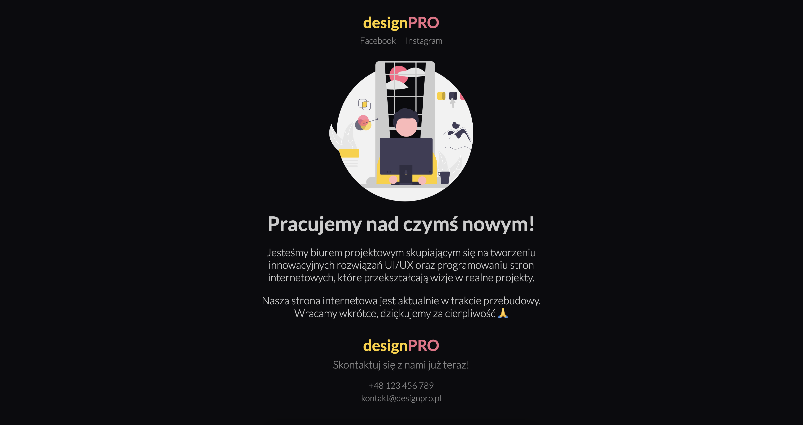

# Egzamin - HTML & CSS
Twoim zadaniem jest przygotowanie strony informującej o trwających pracach nad nową wersją strony internetowej dla biura projektowego UI/UX - designPro. Traktuj to zlecenie jak prawdziwy projekt dla klienta, dbając o szczegóły i jakość wykonania.

## Zadanie
Wykonaj stronę zgodnie z poniższymi wytycznymi korzystając z HTML & CSS. 
Zadanie mozesz rozwiązać korzystając z CodeSandbox lub z Visual Studio Code (rozwiązanie umieść w repozytorium GitHub).

[Kliknij tutaj aby rozwiązać zadanie w CodeSandbox](https://githubbox.com/Publishing-School/ps-html-css-exam)

## Wymagania klienta
Wymagane jest dokładne odwzorowanie [projektu klienta](https://github.com/Publishing-School/ps-html-css-exam/blob/main/zadanie.png).
### Ogólne wytyczne
1. **Tytuł strony:** `DesignPRO - biuro projektowe UI/UX`
2. **Czcionka:** `Lato`, dostępna za pośrednictwem Google Fonts.
3. **Grafiki:** Dostępne w katalogu `assets`.
4. **Kolory:**
   - **Kolor tła:** `#0b0b0e`
   - **Kolor tekstu:** `#cccccc`
   - **Kolor tekstu drugorzędny:** `#cfcfcfa0`
   - **Kolor marki różowy:** `#ed6f86`
   - **Kolor marki żółty:** `#ffcf22`
5. **Bazowy rozmiar czcionki:** `22px`
6. **Efekty dla odnośników:** Odnośniki po najechaniu kursorem mają zmieniać kolor na różowy kolor marki.

### Struktura strony
- **Nagłówek:**
  - Logo firmy wykonane przy użyciu HTML i CSS, z użyciem żółtego i różowego koloru marki.
  - Odnośniki do mediów społecznościowych: Facebook i Instagram z zamieszczonymi linkami.

- **Główna zawartość:**
  - Sekcja informująca o przebudowie strony z odpowiednim graficznym znakiem `w budowie`.
  - Treść informacyjna o działalności firmy i obecnych pracach.

- **Stopka:**
  - Ponowne umieszczenie logo.
  - Dane kontaktowe firmy: numer telefonu i adres e-mail.

### Treść strony
- **Link Facebook:** `https://www.facebook.com/PS-EXAM-DesignPro`
- **Link Instagram:** `https://www.instagram.com/PS-EXAM-DesignPro`
- **Teksty:** 
  
      Pracujemy nad czymś nowym!
      Jesteśmy biurem projektowym skupiającym się na tworzeniu
      innowacyjnych rozwiązań UI/UX oraz programowaniu stron
      internetowych, które przekształcają wizje w realne projekty.

      Nasza strona internetowa jest aktualnie w trakcie przebudowy.
      Wracamy wkrótce, dziękujemy za cierpliwość 🙏 

      Skontaktuj się z nami już teraz! 
      +48 123 456 789 
      kontakt@designpro.pl

